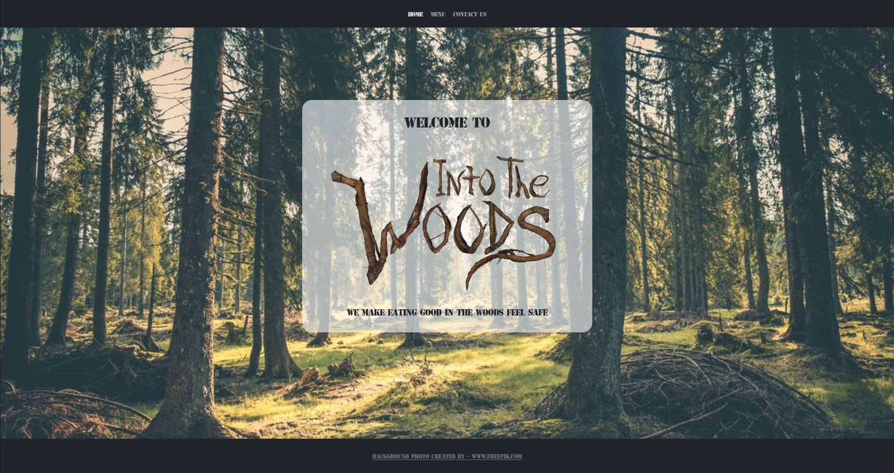

# Restaurant Page

> This project is part of Javascript Module with the aim of building a simple Restaurant page using main features of ES6 and Webpack 

<p align="center">
    <a href="https://img.shields.io/badge/Microverse-blueviolet" alt="Contributors">
        </a>
    <a href="https://www.javascript.com/" alt="JS">
        </a>
    <a href="https://webpack.js.org//" alt="Webpack">
        </a>
    <a href="https://eslint.org/" alt="Eslint">
        </a>
    <a href="https://stylelint.io/" alt="Stylelint">
        </a>
</p>


<b>Restaurant </b> The main goal of this project is to understand the benefits of modularized code as well as the ability to set up a javascript application made of different modules using webpack.

## Watch the Live Version

[Live Demo] https://railona.github.io/restaurentPage/)


### Prerequisites

- JavaScript ES6
- Text Editor
- Git
- NodeJS
- Webpack

## Getting Started

1. Open Terminal.
2. Navigate to your desired location to download the contents of this repository.
3. Copy and paste the following code into the Terminal :
   ```bash
   $ git clone git@github.com:RailonA/restaurentPage.git
   ```
4. Run `cd restaurant-app`
5. Install the needed dependencies 
    ```bash
    $ npm install
    ```
6. run
    ```bash
    npm run build
    ``` 
    to bundle scripts with **_webpack_** a static module bundler for modern JavaScript applications

### Usage
Lauch the local version of this project opening the `dist/index.html` file in the browser

## Contributing

This project was created for educational purposes as part of the Microverse web development curriculum; contributing is not accepted.

Feel free to check the [issues page](https://github.com/RailonA/restaurentPage/issues).

## Author


👤 **Railon Acosta**
- GitHub: [@railonA](https://github.com/RailonA)
- Linkedin: [@railonAcosta](https://www.linkedin.com/in/railon-acosta-81265180/)
- Twitter: [@railonAcosta](https://twitter.com/RailonAcosta)


### Show your support

Give a ⭐️ if you like this project!

## License

This project is licensed under the MIT License
